# 📊 vLedger - Double-Entry Accounting System

A modern, full-stack double-entry accounting system built with TypeScript, featuring a RESTful API backend and a React-based admin panel.

## 🚀 Quick Demo

> **Want to see it in action?** Follow the [Quick Start Guide](#-quick-start-guide) to get the system running in under 5 minutes!

### 📱 Live Preview
- **Admin Panel**: Modern React interface with real-time charts and analytics
- **API Server**: RESTful endpoints for all accounting operations  
- **Database**: SQLite for easy local development (PostgreSQL supported)
- **Sample Data**: Pre-loaded accounts and transactions for immediate testing

<div align="center">

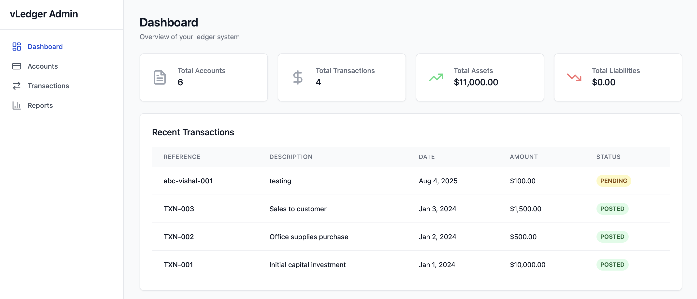
*Clean, modern dashboard with real-time financial insights*

</div>

## 🎯 What You'll Build

Following this guide, you'll have a complete accounting system with:

| Component | What You Get | Preview |
|-----------|--------------|---------|
| **📊 Dashboard** | Real-time financial overview with charts | [View →](assets/admin/screenshots/dashboard1.png) |
| **🏦 Account Management** | Full chart of accounts with different types | [View →](assets/admin/screenshots/accounts.png) |
| **💰 Transaction System** | Double-entry transaction processing | [View →](assets/admin/screenshots/create_transaction.png) |
| **📋 Financial Reports** | Trial balance and general ledger | [View →](assets/admin/screenshots/reports-trial-balance.png) |
| **🔌 REST API** | Complete API for integrations | [Docs →](#-api-endpoints) |

> **Time to Setup**: ~5 minutes | **Tech Stack**: TypeScript + React + Prisma | **Database**: SQLite (ready to go!)

## 📋 Table of Contents

- [🚀 Quick Demo](#-quick-demo)
- [🎯 What You'll Build](#-what-youll-build)
- [🌟 Features](#-features)
- [📸 Screenshots & Demo](#-admin-panel-screenshots--demo)
- [🏗️ System Architecture](#️-system-architecture)
- [📋 Prerequisites](#-prerequisites)
- [🚀 Quick Start Guide](#-quick-start-guide)
- [📁 Project Structure](#-project-structure)
- [📊 API Endpoints](#-api-endpoints)
- [💡 Usage Examples](#-usage-examples)
- [🛠️ Troubleshooting](#️-troubleshooting)

## 🌟 Features

- **Double-Entry Bookkeeping**: Proper accounting principles with automatic balance validation
- **Modern Tech Stack**: TypeScript, Prisma ORM, Express.js, React 18, Tailwind CSS
- **Real-time Dashboard**: Interactive charts and financial summaries
- **Account Management**: Create and manage different account types (Assets, Liabilities, Equity, Revenue, Expenses)
- **Transaction Processing**: Create, post, and manage financial transactions
- **Financial Reports**: Trial Balance, General Ledger, and Account Balances
- **RESTful API**: Complete API for integration with other systems
- **Responsive UI**: Modern, mobile-friendly admin interface

## 📸 Admin Panel Screenshots & Demo

### 🎯 Dashboard Overview
Get a comprehensive view of your financial data with interactive charts and key metrics.

<div align="center">

**Main Dashboard**


**Dashboard with Analytics**
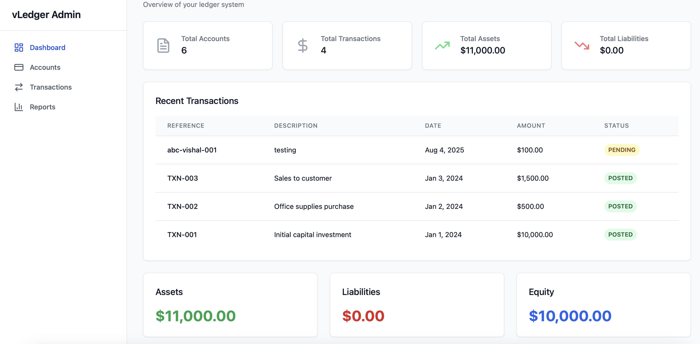

**Charts & Analytics**
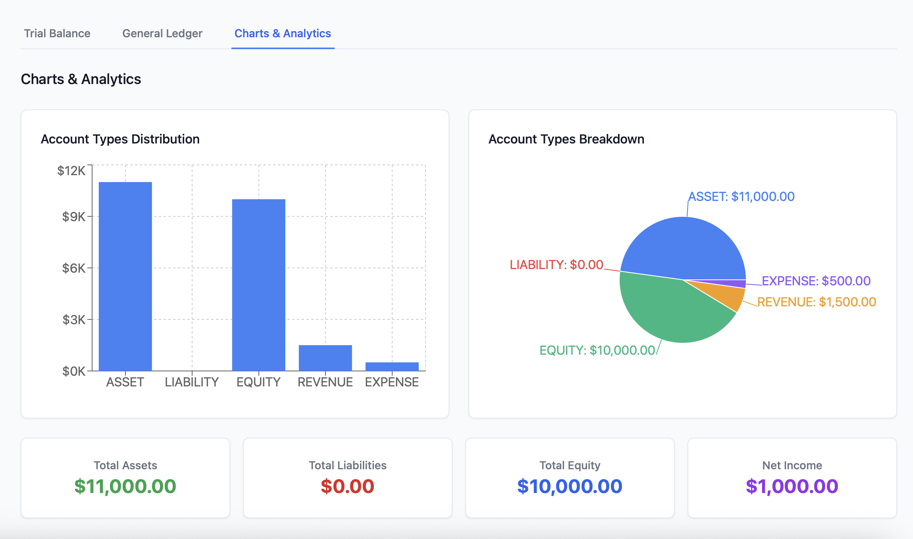

</div>

### 💼 Account Management
Manage your chart of accounts with different account types following standard accounting practices.

<div align="center">

**Accounts Overview**
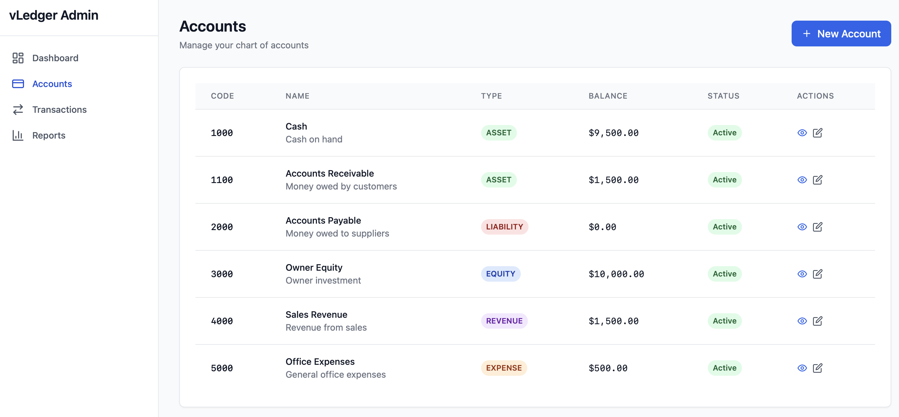

**Create New Account**
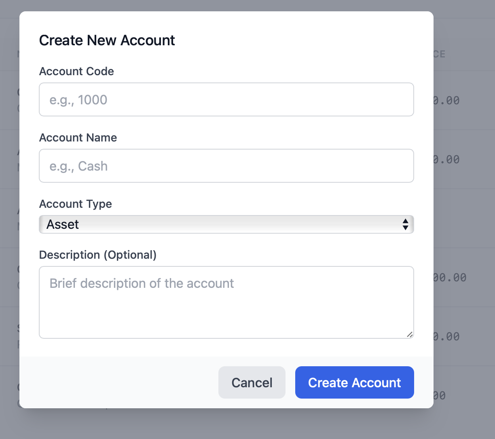

</div>

### 💸 Transaction Management
Create and manage double-entry transactions with automatic balance validation.

<div align="center">

**Transactions List**
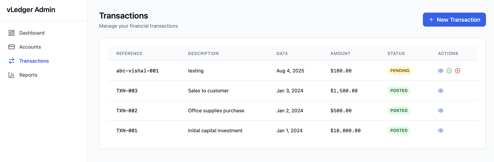

**Create Transaction**
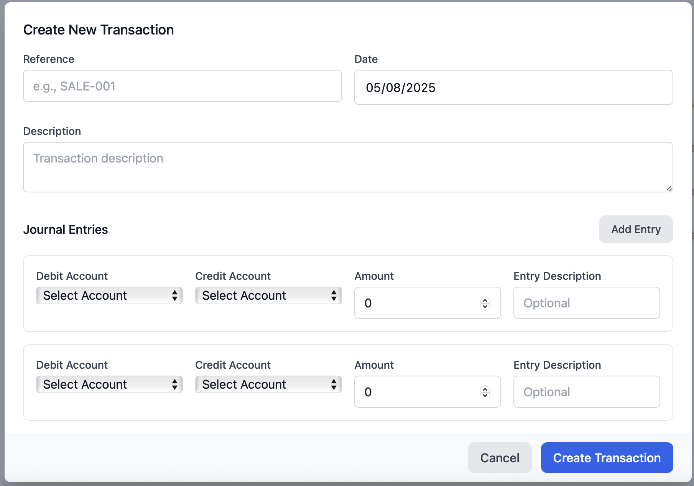

**View Transaction Details**
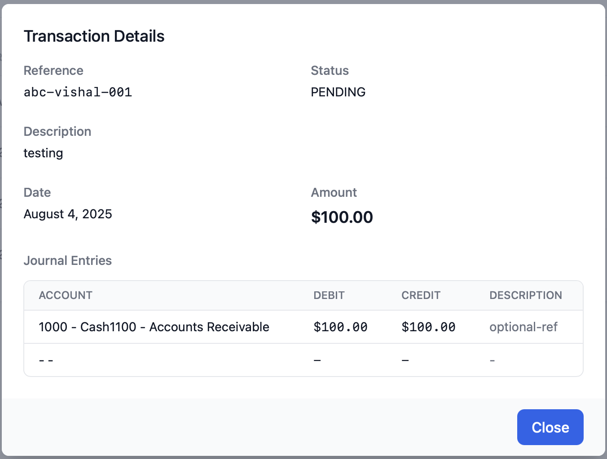

**Transaction Details Extended**
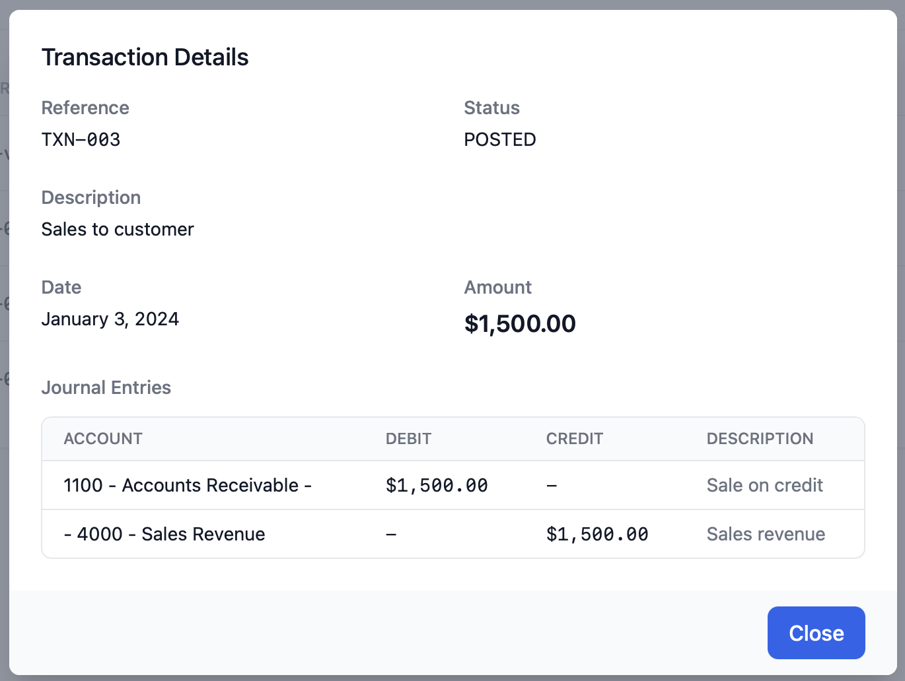

</div>

### 📊 Financial Reports
Generate comprehensive financial reports including Trial Balance and General Ledger.

<div align="center">

**Trial Balance Report**
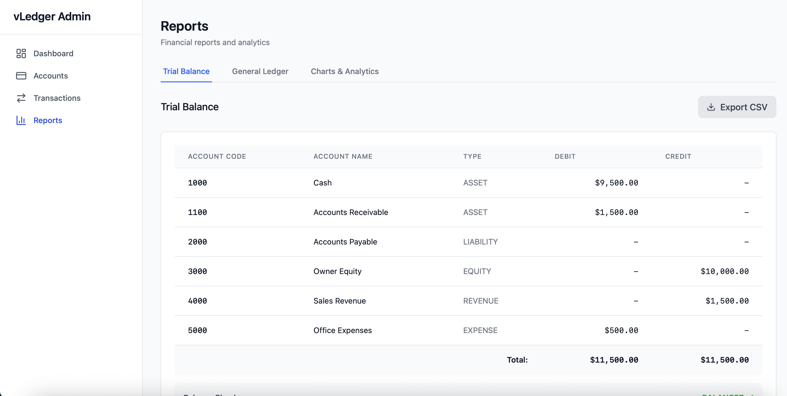

**General Ledger Report**
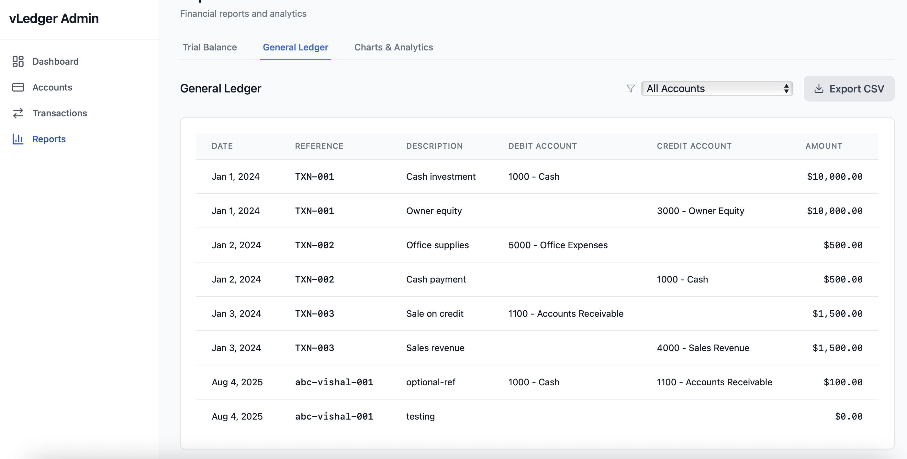

</div>

### ✨ Key Admin Panel Features Demonstrated

| Feature | Description | Screenshot Reference |
|---------|-------------|---------------------|
| **📊 Real-time Dashboard** | Live financial summaries with interactive charts | `dashboard.png`, `dashboard1.png` |
| **📈 Analytics & Charts** | Visual representation of financial data | `chars_and_analytics.png` |
| **🏦 Account Management** | Create and manage chart of accounts | `accounts.png`, `create_account.png` |
| **💰 Transaction Processing** | Double-entry transaction creation and management | `transactions.png`, `create_transaction.png` |
| **🔍 Transaction Details** | Comprehensive transaction view with journal entries | `view_transaction.png`, `view_transaction1.png` |
| **📋 Trial Balance** | Standard accounting trial balance report | `reports-trial-balance.png` |
| **📖 General Ledger** | Detailed general ledger with filtering options | `general-ledger.png` |

### 🎨 UI/UX Highlights

- **🎯 Clean, Modern Interface**: Intuitive design following modern web standards
- **📱 Responsive Design**: Works seamlessly on desktop, tablet, and mobile devices
- **🎪 Interactive Charts**: Real-time data visualization using Recharts
- **🔍 Easy Navigation**: Clear sidebar navigation with visual indicators
- **✅ Form Validation**: Real-time validation for all data entry forms
- **🎨 Professional Styling**: Tailwind CSS for consistent, beautiful design
- **⚡ Fast Performance**: Optimized React components with efficient state management

## 🎬 Features in Action

### 📊 Dashboard & Analytics
The main dashboard provides a comprehensive overview of your financial position with real-time charts and key performance indicators.


**What you can do:**
- 📈 View real-time financial summaries
- 📊 Interactive charts for data visualization  
- 🎯 Quick access to key metrics
- 📱 Responsive design for any device

### 🏦 Smart Account Management
Create and organize your chart of accounts following standard accounting practices.


**Key features:**
- ✅ Account type validation (Asset, Liability, Equity, Revenue, Expense)
- 🔢 Automatic account code generation
- 📝 Detailed descriptions and categorization
- 🎨 Clean, intuitive forms

### 💰 Double-Entry Transaction Processing
Create transactions that automatically maintain the fundamental accounting equation.


**Powerful capabilities:**
- ⚖️ Automatic debit/credit balance validation
- 📅 Date and reference tracking
- 📝 Detailed transaction descriptions
- 🔄 Real-time balance updates

### 📋 Professional Financial Reports
Generate standard accounting reports with filtering and export capabilities.


**Report types:**
- 📊 Trial Balance with totals validation
- 📖 General Ledger with transaction details
- 🔍 Account-specific reporting
- 📈 Visual data representation

## 🏗️ System Architecture

```
┌─────────────────┐    ┌─────────────────┐    ┌─────────────────┐
│   Admin Panel   │    │   API Server    │    │   Database      │
│   (React +      │◄──►│   (Express +    │◄──►│   (SQLite +     │
│   Tailwind)     │    │   TypeScript)   │    │   Prisma)       │
│   Port: 3001    │    │   Port: 3000    │    │                 │
└─────────────────┘    └─────────────────┘    └─────────────────┘
```

## 📋 Prerequisites

Before you begin, ensure you have the following installed:

- **Node.js** (v16 or higher) - [Download here](https://nodejs.org/)
- **npm** (comes with Node.js) or **yarn**
- **Git** - [Download here](https://git-scm.com/)

## 🚀 Quick Start Guide

### Step 1: Clone the Repository

```bash
git clone https://github.com/Vishalbhuva007/vLedger.git
cd vLedger
```

### Step 2: Install Dependencies

Install backend dependencies:
```bash
npm install
```

Install admin panel dependencies:
```bash
npm run admin:install
```

### Step 3: Configure Environment Variables

Create a `.env` file in the root directory:
```bash
cp .env.example .env
```

Update the `.env` file with the SQLite database configuration:
```properties
# Database Configuration
DATABASE_URL="file:./dev.db"

# Optional: API Configuration
PORT=3000
NODE_ENV=development
```

### Step 4: Set Up the Database

Generate Prisma client:
```bash
npm run generate
```

Create and initialize the database:
```bash
npx prisma migrate dev --name init
```

### Step 5: Seed Sample Data (Optional)

Load sample accounts and transactions:
```bash
npx ts-node scripts/seed.ts
```

This will create:
- 6 sample accounts (Cash, Accounts Receivable, etc.)
- 3 sample transactions demonstrating double-entry bookkeeping

### Step 6: Start the Application

Start both the API server and admin panel:

**Terminal 1 - API Server:**
```bash
npm run dev
```

**Terminal 2 - Admin Panel:**
```bash
cd admin && npm run dev
```

### Step 7: Access the Application

- **Admin Panel**: [http://localhost:3001](http://localhost:3001)
- **API Health Check**: [http://localhost:3000/health](http://localhost:3000/health)
- **API Base URL**: `http://localhost:3000`

### 🎉 You're Done!

Your vLedger system is now running! You should see:

1. **Dashboard** - Financial overview with charts ([screenshot](assets/admin/screenshots/dashboard.png))
2. **Accounts** - Pre-loaded chart of accounts ([screenshot](assets/admin/screenshots/accounts.png))
3. **Transactions** - Sample transactions demonstrating double-entry ([screenshot](assets/admin/screenshots/transactions.png))
4. **Reports** - Trial balance and general ledger ([screenshot](assets/admin/screenshots/reports-trial-balance.png))

> 💡 **Pro Tip**: Check out the [Screenshots & Demo](#-admin-panel-screenshots--demo) section below to see all the features in action!

## 📁 Project Structure

```
vLedger/
├── src/                          # Backend source code
│   ├── services/
│   │   └── LedgerService.ts      # Core business logic
│   ├── types/                    # TypeScript type definitions
│   └── index.ts                  # Express server entry point
├── admin/                        # Frontend admin panel
│   ├── src/
│   │   ├── components/           # Reusable React components
│   │   ├── pages/                # Page components
│   │   ├── services/             # API client services
│   │   └── types/                # Frontend type definitions
│   ├── public/                   # Static assets
│   └── package.json              # Frontend dependencies
├── prisma/
│   ├── schema.prisma             # Database schema
│   └── migrations/               # Database migrations
├── scripts/
│   ├── seed.ts                   # Database seeding script
│   └── examples/                 # Usage examples
├── .env                          # Environment variables
└── package.json                  # Backend dependencies
```

## 🔧 Available Scripts

### Backend Scripts
- `npm run dev` - Start development server with hot reload
- `npm run build` - Build for production
- `npm run start` - Start production server
- `npm run generate` - Generate Prisma client

### Admin Panel Scripts
- `npm run admin:install` - Install admin panel dependencies
- `cd admin && npm run dev` - Start admin panel development server
- `cd admin && npm run build` - Build admin panel for production

## 📊 API Endpoints

### Accounts
- `GET /accounts` - List all accounts
- `POST /accounts` - Create a new account
- `GET /accounts/:id` - Get account by ID
- `GET /accounts/code/:code` - Get account by code
- `GET /accounts/code/:code/balance` - Get account balance

### Transactions
- `GET /transactions` - List all transactions
- `POST /transactions` - Create a new transaction
- `GET /transactions/:id` - Get transaction by ID
- `POST /transactions/:id/post` - Post a transaction
- `POST /transactions/:id/cancel` - Cancel a transaction

### Reports
- `GET /reports/trial-balance` - Generate trial balance
- `GET /reports/general-ledger` - Generate general ledger
- `GET /reports/general-ledger?accountCode=1000` - Account-specific ledger

## 💡 Usage Examples

### Creating an Account
```bash
curl -X POST http://localhost:3000/accounts \
  -H "Content-Type: application/json" \
  -d '{
    "code": "1000",
    "name": "Cash",
    "type": "ASSET",
    "description": "Cash on hand"
  }'
```

### Creating a Transaction
```bash
curl -X POST http://localhost:3000/transactions \
  -H "Content-Type: application/json" \
  -d '{
    "reference": "TXN-001",
    "description": "Office supplies purchase",
    "date": "2024-01-15",
    "entries": [
      {
        "debitAccountCode": "5000",
        "amount": 250,
        "description": "Office supplies"
      },
      {
        "creditAccountCode": "1000",
        "amount": 250,
        "description": "Cash payment"
      }
    ]
  }'
```

## 🎯 Key Concepts

### Double-Entry Bookkeeping
Every transaction must have equal debits and credits:
- **Debits** increase Assets and Expenses
- **Credits** increase Liabilities, Equity, and Revenue
- Total debits must equal total credits for each transaction

### Account Types
- **ASSET**: Things the business owns (Cash, Equipment, Inventory)
- **LIABILITY**: Things the business owes (Accounts Payable, Loans)
- **EQUITY**: Owner's stake in the business
- **REVENUE**: Money earned from operations
- **EXPENSE**: Costs of doing business

### Transaction Lifecycle
1. **PENDING**: Transaction created but not yet posted
2. **POSTED**: Transaction is final and affects account balances
3. **CANCELLED**: Transaction is voided

## 🛠️ Troubleshooting

### Common Issues

**1. Database Connection Error**
```
Error: Database not found
```
**Solution**: Run `npx prisma migrate dev --name init` to create the database.

**2. Port Already in Use**
```
Error: listen EADDRINUSE: address already in use :::3000
```
**Solution**: Stop other processes using the port or change the PORT in `.env`.

**3. Admin Panel Blank Page**
- Check browser console for errors
- Ensure API server is running on port 3000
- Verify admin panel is running on port 3001

**4. Environment Configuration**
Make sure your `.env` file contains:
```
DATABASE_URL="file:./dev.db"
```

### Development Tips

1. **Hot Reload**: Both backend and frontend support hot reload during development
2. **Database Reset**: Use `npx prisma migrate reset` to start fresh (development only)
3. **API Testing**: Use tools like Postman or curl to test API endpoints
4. **Browser DevTools**: Check Network tab for API call failures

## 🧪 Testing

### Manual Testing Checklist
- [ ] API server starts without errors
- [ ] Admin panel loads successfully
- [ ] Can create new accounts
- [ ] Can create balanced transactions
- [ ] Trial balance shows correct totals
- [ ] Reports generate without errors

### Sample Test Data
The seed script creates a complete example with:
- Initial capital investment ($10,000)
- Office expense transaction ($500)
- Customer sale on credit ($1,500)

## 🔐 Security Considerations

- **Environment Variables**: Never commit `.env` files to version control
- **Input Validation**: All API endpoints validate input data
- **SQL Injection**: Prisma ORM provides protection against SQL injection
- **CORS**: Configured for development (update for production)

## 🚀 Production Deployment

### Environment Setup
1. Update `.env` for production database
2. Set `NODE_ENV=production`
3. Configure proper CORS origins
4. Use process manager (PM2, Docker, etc.)

### Build Commands
```bash
# Build backend
npm run build

# Build admin panel
cd admin && npm run build

# Start production server
npm run start
```

## 🤝 Contributing

1. Fork the repository
2. Create a feature branch (`git checkout -b feature/amazing-feature`)
3. Commit your changes (`git commit -m 'Add amazing feature'`)
4. Push to the branch (`git push origin feature/amazing-feature`)
5. Open a Pull Request

## 📄 License

This project is licensed under the MIT License - see the [LICENSE](LICENSE) file for details.

## 🙏 Acknowledgments

- Built with [Prisma](https://prisma.io/) for database management
- UI components inspired by [Tailwind UI](https://tailwindui.com/)
- Charts powered by [Recharts](https://recharts.org/)
- Icons from [Lucide React](https://lucide.dev/)

## 📞 Support

If you encounter any issues or have questions:

1. Check the [troubleshooting section](#-troubleshooting)
2. Search existing [GitHub Issues](https://github.com/Vishalbhuva007/vLedger/issues)
3. Create a new issue with detailed information

---

**Happy Accounting!** 📊✨
